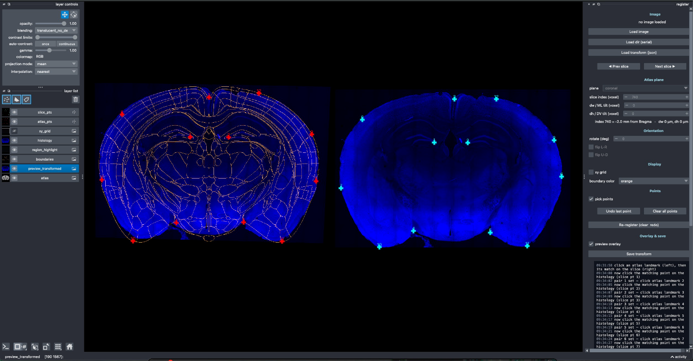
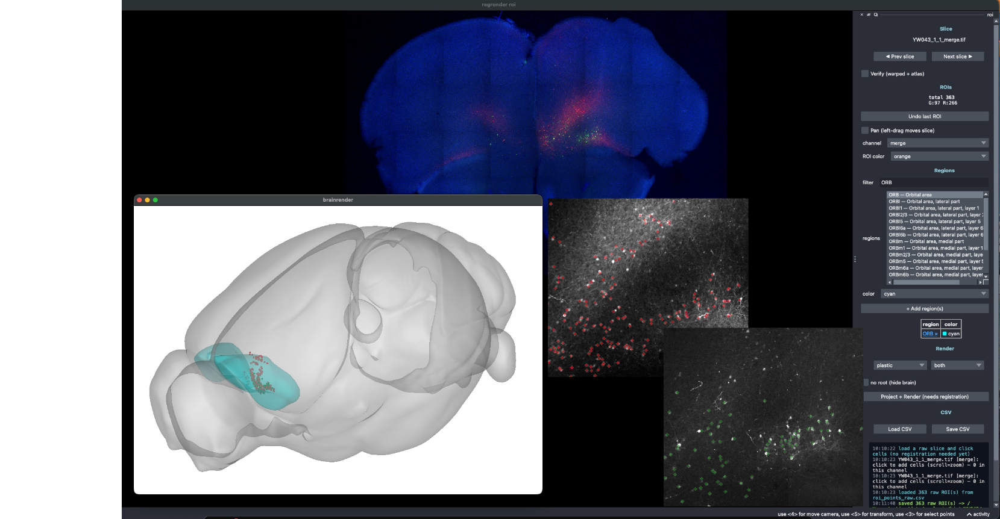
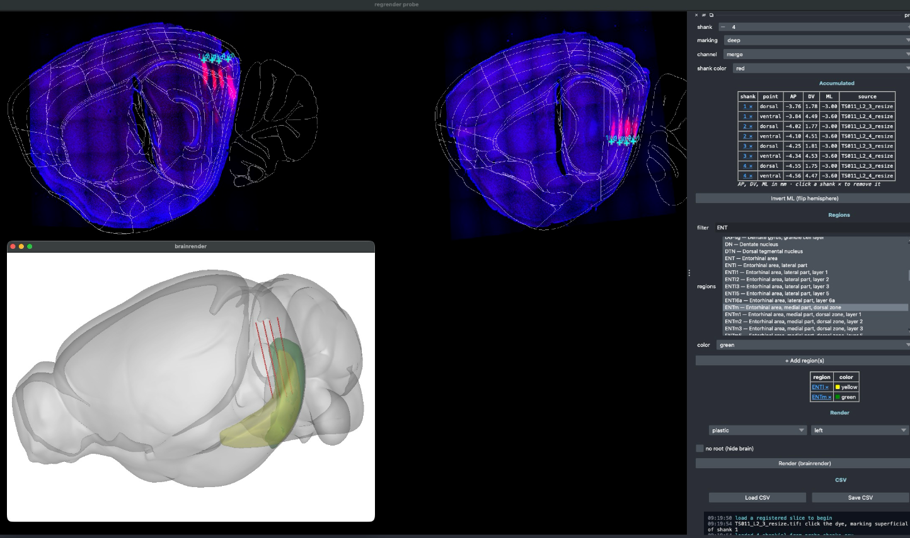

# regrender

[](https://pypi.org/project/regrender/)
[](https://pypi.org/project/regrender/)
[](https://github.com/ytsimon2004/regrender/blob/main/LICENSE)
[](https://github.com/ytsimon2004/regrender/actions/workflows/ci.yml)
[](https://regrender.readthedocs.io)

**Tools for 2D mouse brain registration to the Allen Common Coordinate Framework (CCF)**

A napari-based Python toolkit
For registering histological brain slices to the Allen Brain Atlas, annotating cells/ROIs,
reconstructing probe tracks, and rendering the results with brainrender.

> [!TIP]
> **Full documentation: [regrender documentation](https://regrender.readthedocs.io)**

## Features

- **Interactive slice→CCF registration** (`regrender register`) — pick landmark pairs in napari, estimate a homography/affine transform.
- **ROI annotation** (`regrender roi`) — label cells on raw images, project them into CCF space, and render.
- **Probe-track reconstruction** (`regrender probe`) — reconstruct electrode shanks from dye labels across serial sections.
- **brainrender rendering** of ROIs and probes in 3D atlas space.

## Demo

**`regrender register`** — match landmark pairs between the atlas plane (left) and histology (right):



**`regrender roi`** — label cells per channel, then project + render in 3D with brainrender:



**`regrender probe`** — pick dye points per shank and reconstruct the tracks in 3D:




## Installation

```bash
# Option 1 — one-shot CLI install, no clone or env needed (recommended for users)
uv tool install git+https://github.com/ytsimon2004/regrender.git

# Option 2 — uv virtual environment (development)
git clone https://github.com/ytsimon2004/regrender.git && cd regrender
uv venv && source .venv/bin/activate
uv pip install -e .

# Option 3 — conda environment (development)
git clone https://github.com/ytsimon2004/regrender.git && cd regrender
conda create -n regrender python=3.12 -y && conda activate regrender
pip install -e .
```

See the [installation docs](https://regrender.readthedocs.io/en/latest/get_start/installation.html) for details.

## Quick Start

```bash
# Register each slice to the CCF   -> opens the registration GUI
regrender register -D <slices_dir>

# Label ROIs on raw slices        -> opens the ROI GUI
regrender roi -D <slices_dir>

# Probe tracks                        -> opens the probe GUI
regrender probe -D <slices_dir>

```

See the [full documentation](https://regrender.readthedocs.io) for the complete workflow.

## Contact

**Yu-Ting Wei** - ytsimon2004@gmail.com
